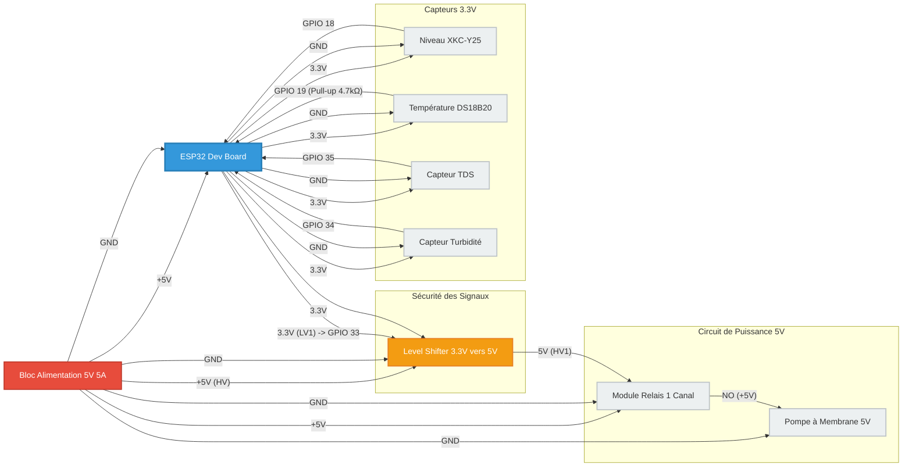
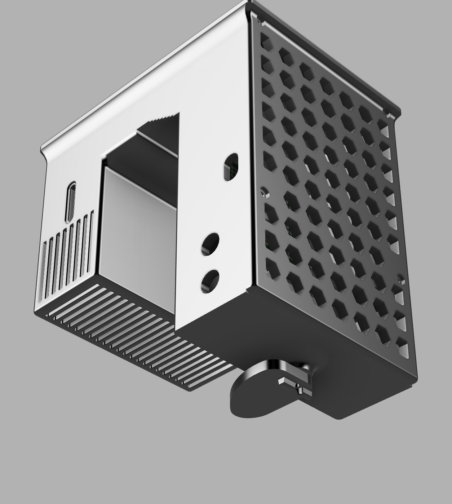
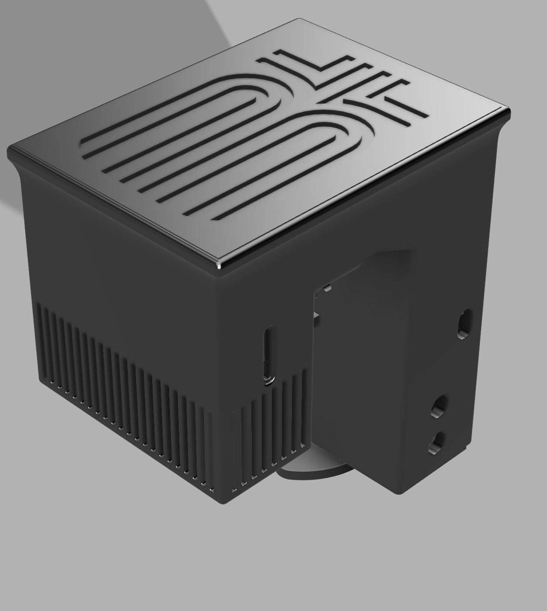
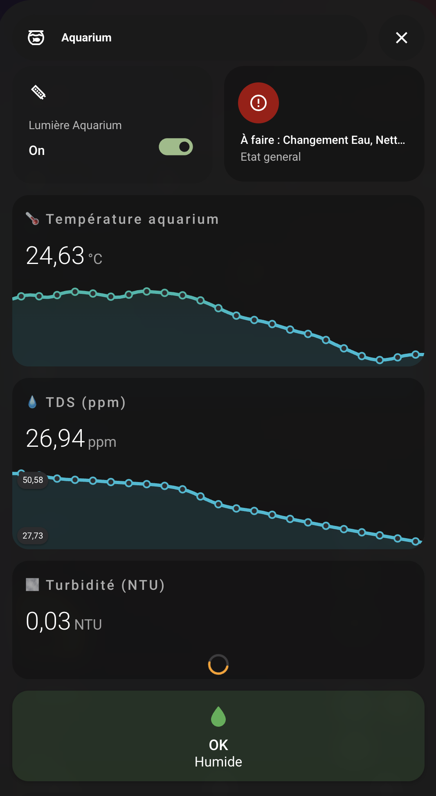

# 🌊 AquaSense: Intelligent Water Quality Monitoring

[](LICENSE)
[](https://esphome.io/)
[](https://platformio.org/)
[](https://www.espressif.com/en/products/socs/esp32)

**AquaSense** is a comprehensive IoT solution dedicated to real-time water quality monitoring. This project showcases cross-disciplinary expertise combining **Software Engineering (C++/YAML)**, **Analog Electronics**, and **Mechanical Design (3D CAD)**.

---

## 🌟 Project Highlights

- **Multi-Framework Architecture**: Native support for **PlatformIO (Pure C++)** for low-level control, and **ESPHome** for seamless Home Automation (Home Assistant) integration.
- **Advanced Signal Processing**: Implementation of 3rd-degree polynomial regression algorithms for TDS (Total Dissolved Solids) and Turbidity sensors to ensure data accuracy.
- **Industrial Design**: Custom-designed, 3D-printed enclosures and sensor mounts optimized for durability and easy maintenance in aquatic environments.
- **Mission-Critical Safety**: Integrated hardware and software "Fail-safe" logic for pump control to prevent flooding or dry running.

---

## 🛠️ Technical Expertise

### 1. Electronics & Sensors
The system is built around the **ESP32** microcontroller, managing multiple data protocols:
- **OneWire**: High-precision communication with the DS18B20 thermal probe.
- **ADC (Analog to Digital Converter)**: Optimized reading of turbidity and TDS analog values with software attenuation for maximum 3.3V precision.
- **Relay Control**: High-power actuator management with built-in duty cycle protection.

### 2. Algorithms & Mathematics
To ensure laboratory-grade reliability, the firmware processes raw analog signals into meaningful data:
- **TDS Conversion**: Utilizes a 3rd-degree polynomial regression curve to compensate for the non-linear response of analog TDS probes.
- **Turbidity Calibration**: Scalable linear calibration to provide precise NTU (Nephelometric Turbidity Units) readings.

### 3. Mechanical Design (CAD)
Source files (FreeCAD/STEP) provide a modular and industrial enclosure system:
- **Modular Controller Hub**: A multi-part assembly including a main box with integrated cooling vents and dedicated internal supports for electronics.
- **Branded Top Cover**: Custom embossed branding with a sleek, minimalist aesthetic.
- **Versatile Mounting**: Features an `eccentric bolt` system for secure attachment to various aquatic environments (tanks, sumps, etc.).
- **Optimized Sensor Kits**: Protective mounts for TDS and Turbidity probes designed to minimize interference with water flow.

---

## 🔌 Circuitry & Schematics

The system architecture ensures galvanic isolation for the actuators and precise signal levels for the sensors. Below is the logical wiring diagram:



---

## 🔧 Assembly & Hardware

The AquaSense enclosure is designed for durability and ease of maintenance. 

### 1. Hardware Requirements
- **Fasteners**: M3 Stainless Steel screws are used throughout to prevent corrosion in humid environments.
- **Mounting**: Brass heat-set inserts can be used for the internal supports to allow repeated assembly/disassembly without stripping the plastic.
- **Connectivity**: A panel-mount USB-C extension provides a robust external power interface while keeping the ESP32 protected inside.

### 2. Assembly Steps
1.  **Preparation**: Install M3 heat-set inserts (optional) into the `Main Controller Box`.
2.  **Electronics**: Secure the ESP32 Dev Board onto the `Electronic Card Support` tray.
3.  **Integration**: Slide the electronic tray into the main box and secure the cables through the dedicated ports.
4.  **Sealing**: Install the `Back Cover` for cable management and the `Top Cover` for final protection.
5.  **Deployment**: Use the `Eccentric Bolt` system to clamp the unit onto your tank or sump.

For a full list of components, see the [Bill of Materials (BOM)](BOM.md).

---

## 📂 Project Structure

```bash
├── 📂 firmware           # Firmware source code
│   ├── 📂 cpp            # Pure C++ Firmware (PlatformIO)
│   └── 📂 esphome        # Infrastructure as Code (YAML)
├── 📂 cad                # CAD Files (STL, STEP, FCStd)
├── 📂 assets            # Project images and diagrams
├── 📂 .github           # CI/CD Pipelines
└── LICENSE              # MIT License
```

---

## ⚙️ Installation & Deployment

### Option A: ESPHome (Recommended for Home Assistant)
1. Install ESPHome: `pip install esphome`
2. Copy `firmware/esphome/secrets.yaml.example` to `firmware/esphome/secrets.yaml` and fill in your credentials.
3. Deploy: `esphome run firmware/esphome/aquasense.yaml`

### Option B: PlatformIO (For C++ Development)
1. Open the `firmware/cpp` folder in VS Code with PlatformIO.
2. Compile and flash to your ESP32.

---

## 📊 Gallery & Showcase

| Industrial Enclosure | Branded Top Cover | Home Assistant Dashboard |
| :---: | :---: | :---: |
|  |  |  |

---

## 📝 License

This project is released under the **MIT License**. Feel free to use, modify, and distribute it for your own projects.

---

## 👤 Contact & Portfolio

**Enzo Gaggiotti**
- **Specialization**: IoT, Infrastructure, DevSecOps.
- [GitHub Profile](https://github.com/enzogagg)
